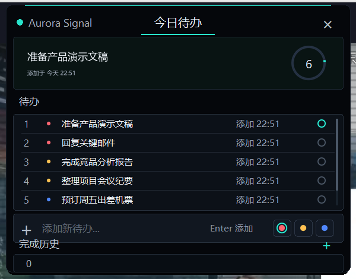
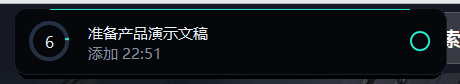

# Dynamic Todo Island

> Windows 桌面顶部悬浮的“灵动岛”待办事项小工具。

**语言 / Language**：中文优先展示；English version is available below.



Dynamic Todo Island 使用 Python + Tkinter 实现，不需要服务器、不需要部署，也不需要 Electron 运行时。它平时隐藏在屏幕顶部，只露出一条细边；当鼠标靠近顶部时会自动拉出，显示当前最重要的一条待办。

当前视觉方向是 **Aurora Signal**：黑色玻璃胶囊、青绿色状态光、焦点任务卡片和优先级队列。

## 界面预览

紧凑态：鼠标靠近屏幕顶部时自动拉出，展示当前焦点任务。



展开态：点击紧凑态后进入完整面板，可以查看队列、添加待办、选择优先级和撤回历史。


## 功能

- 不聚焦时隐藏在屏幕顶部，只露出一条细边。
- 鼠标移动到屏幕顶部细边后，小灵动岛会自动拉下来，显示当前最高优先级的一条待办。
- 点击小灵动岛后展开详情，待办区默认展示三条，支持滚轮查看更多。
- 勾选待办后标记为完成，并自动切换到下一条。
- 点击待办标题可将其置顶到灵动岛，覆盖默认优先级排序；再次点击取消置顶。
- 完成事项不会删除，会保存在完成历史里，并支持一键撤回。
- 展开状态下可以添加待办，并用颜色点选择紧急程度。
- 完成历史位于列表下方，是独立固定区域，支持滚轮查看更多历史。
- 右键拖动悬浮窗可以临时调整位置。
- 右键系统托盘图标可以显示窗口或退出应用。

数据保存在本机 JSON 文件中：

```text
%LOCALAPPDATA%\DynamicTodoIsland\todos.json
```

## 运行

方式一：桌面快捷方式

将 `run.bat` 右键发送到桌面，之后双击桌面图标即可启动。

方式二：命令行

```powershell
cd F:\project\dynamic-todo-island
pip install -r requirements.txt
python app.py
```

## 使用示例

1. 启动应用后，把鼠标移动到屏幕顶部边缘，小灵动岛会自动展开。
2. 点击小灵动岛主体进入展开视图。
3. 在输入框中输入 `回复客户邮件`，点击右侧红色优先级点，按 Enter 添加高优先级待办。
4. 点击某条待办标题，把它置顶到灵动岛作为当前焦点任务。
5. 完成后点击待办右侧圆圈，它会进入完成历史。
6. 如果误点完成，在完成历史中点击 `撤回`，待办会回到当前队列。

## 交互

- 鼠标移到屏幕顶部细边：拉出小灵动岛。
- 点击小灵动岛主体：展开列表。
- 点击待办右侧圆圈：完成待办。
- 点击待办标题区域：置顶到灵动岛优先展示，再次点击取消。
- 点击完成历史里的 `撤回`：把误完成的待办恢复到当前队列。
- 点击输入框：占位提示会消失，输入后按 Enter 添加。
- 点击输入框右侧颜色点：选择待办紧急程度。
- 在待办区滚轮：查看更多待办。
- 在历史区滚轮：查看更多完成历史。
- 右键拖动窗口：临时调整悬浮窗位置。
- 右键系统托盘图标：显示窗口或退出应用。

## 文件说明

- `app.py`：完整桌面小工具。
- `run.bat`：双击启动脚本，可发送到桌面作为快捷方式。
- `requirements.txt`：Python 依赖，包括 Pillow（抗锯齿图形）和 pystray（系统托盘）。
- `DynamicTodoIsland.spec`：PyInstaller 打包配置。

<details>
<summary>English</summary>

## English Introduction

Dynamic Todo Island is a small Windows desktop todo widget that floats at the top edge of the screen. It is built with Python + Tkinter, so it does not need a backend server, deployment step, or Electron runtime.

The current visual direction is **Aurora Signal**: a dark glass pill, cyan-green status light, focus task card, and priority-based task queue. The window stays hidden above the screen most of the time, leaving only a thin edge visible; when the mouse reaches the top edge, it slides down and shows the most important todo.

### Preview

Compact view:


Expanded view:


### Features

- Hides at the top of the screen when idle, with only a thin trigger edge visible.
- Reveals a compact island when the mouse reaches the top edge.
- Shows the highest-priority active todo in compact mode.
- Expands into a larger panel with a focus card, todo list, input row, priority selector, and completion history.
- Marks todos as completed without deleting them.
- Keeps completed todos in history and supports one-click undo.
- Lets you pin a todo as the current focus item by clicking its title.
- Supports independent mouse-wheel scrolling for the active todo list and completion history.
- Allows temporary repositioning with right-click drag.
- Provides a system tray menu for showing the window or quitting the app.

Todo data is stored locally as JSON:

```text
%LOCALAPPDATA%\DynamicTodoIsland\todos.json
```

### Run

Option 1: Desktop shortcut

Right-click `run.bat`, send it to the desktop, then double-click the shortcut to launch the app.

Option 2: Command line

```powershell
cd F:\project\dynamic-todo-island
pip install -r requirements.txt
python app.py
```

### Usage Example

1. Launch the app and move your mouse to the top edge of the screen.
2. Click the compact island to open the expanded panel.
3. Type `Reply to client email` in the input field, choose the red priority dot, and press Enter to add a high-priority todo.
4. Click a todo title to pin it as the current focus item in the island.
5. Click the circle on the right side of a todo to mark it completed.
6. If you completed the wrong item, click `Undo` in the history list to restore it.

### Interaction

- Move the mouse to the top trigger edge: reveal the compact island.
- Click the compact island body: open the expanded todo panel.
- Click the circle on the right side of a todo: complete the todo.
- Click a todo title area: pin it as the focus item; click again to unpin it.
- Click `Undo` in completion history: restore a completed todo to the active queue.
- Click the input field: clear the placeholder, then press Enter to add a todo.
- Click the colored dots beside the input field: choose task priority.
- Scroll over the todo area: browse more active todos.
- Scroll over the history area: browse more completed todos.
- Right-click and drag the window: temporarily reposition it.
- Right-click the tray icon: show the window or quit the app.

### Project Files

- `app.py`: Main desktop widget implementation.
- `run.bat`: Convenience launcher that can be sent to the desktop as a shortcut.
- `requirements.txt`: Python dependencies, including Pillow for anti-aliased graphics and pystray for the system tray.
- `DynamicTodoIsland.spec`: PyInstaller packaging configuration.

</details>
